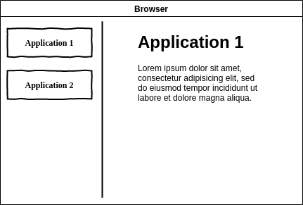
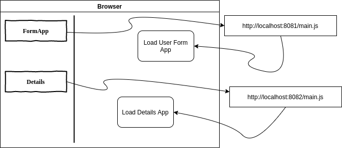

# Micro-Frontend Example 



Micro-Frontend Example , has following applications:

**container-app** : Sample Composition Application , compose micro frontend  applications and integrate application. Provides  Layouts, commons and navigation. On clicking sidenav menu it loads the corresponding application

**user-app** : User application gets  information , on submission it passes the information to the details application .

**details-app** : Show user details passed from user-app.





## Build
```
# Build UI applications and build docker images
$sudo ./build.sh
```

## Run
```
sudo docker-compose up
```

## Run Applicaions
```sh
$sudo docker run -d --name container-app -p 8080:80  jrsaravanan/container-app
$sudo docker run -d --name usr -p 8081:80 jrsaravanan/user-app
$sudo docker run -d --name details -p 8082:80 jrsaravanan/details-app

```
